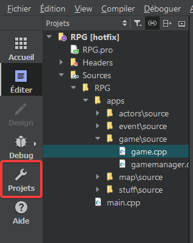
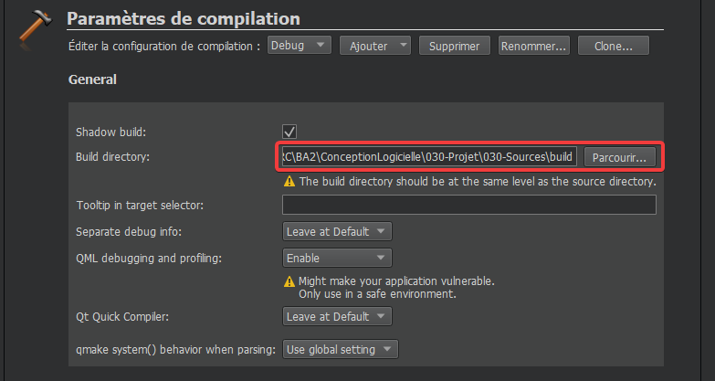
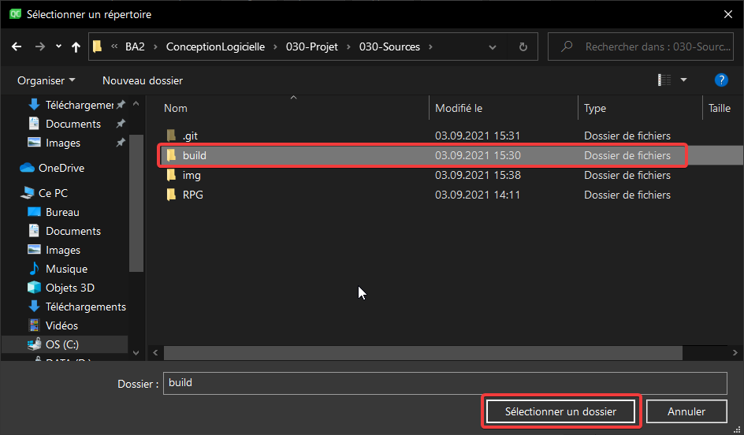

# Project Overview

- [Project Wiki](https://gitlab-etu.ing.he-arc.ch/isc/2021-22/niveau-2/conception-logiciel-intro-donnees/g3/-/wikis/home)

# Informations
The final version of this project is under the tag `v1.1`.

In order to launch the game, you have to do some modifications.

First, you have to change your screen zoom to 100%.

If you download the project locally, you have to go in `Riddle.h`, and change the static variable `RELEASE_MODE` to `false`.
Then, you must change the build directory in Qt Creator.

Here are the steps to do

**1st Step**

**2nd Step**

**3rd Step**

# Contributors

### Authors
- [Jeannin Vincent](mailto:vincent.jeannin@he-arc.ch)
- [Mouchet Benjamin](mailto:benjamin.mouchet@he-arc.ch)
- [Mouchet Guillaume](mailto:guillaume.mouchet@he-arc.ch)

### Professors
- [Beurret Stéphane](mailto:stephane.beurret@he-arc.ch)
- [Le Callennec Benoit](mailto:benoit.lecallennec@he-arc.ch)

### Assistants
- [Divernois Margaux](mailto:margaux.divernois@he-arc.ch)
- [Srdjenovic Luca](mailto:luca.srdjenovic@he-arc.ch)

&copy; 2021 All rights reserved, HE-Arc

